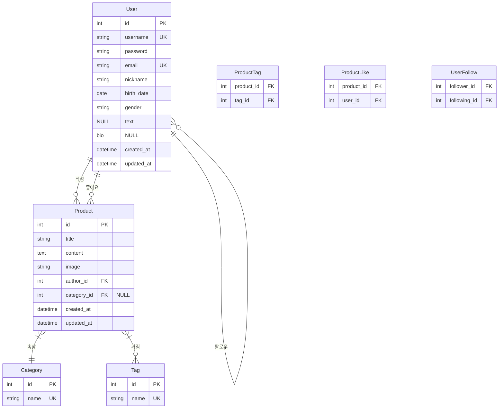

# Sparta Market DRF - ERD

## 테이블 설명

### User (사용자)
- 기본 사용자 정보 저장
- `username`과 `email`은 고유값
- `gender`와 `bio`는 선택 입력 가능

### Product (상품)
- 상품 정보 저장
- `author_id`로 작성자 참조
- `category_id`로 카테고리 참조 (선택사항)

### Category (카테고리)
- 상품 카테고리 정보
- `name`은 고유값

### Tag (태그)
- 상품에 적용 가능한 태그
- `name`은 고유값

### ProductTag (상품-태그 관계)
- Product와 Tag의 다대다 관계 테이블

### ProductLike (상품 좋아요)
- Product와 User의 다대다 관계 테이블
- 상품 좋아요 정보 저장

### UserFollow (팔로우 관계)
- User 간의 팔로우 관계를 저장하는 다대다 관계 테이블
- `follower_id`: 팔로우하는 사용자
- `following_id`: 팔로우 받는 사용자

## 관계 설명
- 한 User는 여러 Product를 작성할 수 있음 (1:N)
- 한 User는 여러 Product에 좋아요를 할 수 있음 (M:N)
- 한 User는 여러 User를 팔로우할 수 있음 (M:N)
- 한 Product는 하나의 Category에 속함 (N:1)
- 한 Product는 여러 Tag를 가질 수 있음 (M:N)
